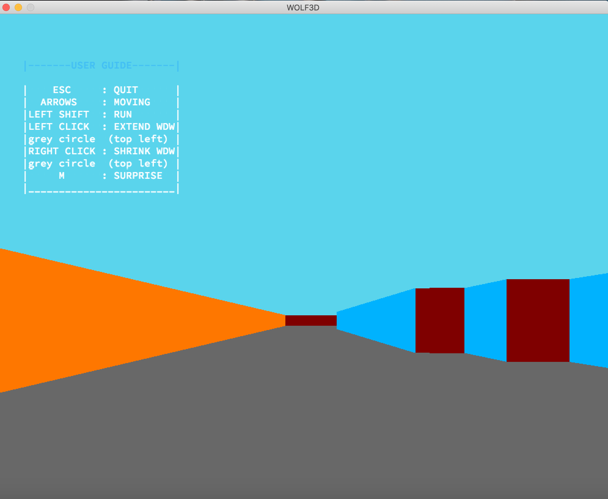

# Wolf3D

<i>Graphic programming project</i> 
Program which is modeling 3D labyrinths based on Ray-Casting principles.
 
 
<b>USAGE:</b> <i>./wolf3d map/[map1, map2, map3]</i>
 
 
<b>Example:</b>
 

## USER GUIDE:
 
|-------USER GUIDE-------| 
|    ESC     : QUIT      | 
|  ARROWS    : MOVING    | 
|LEFT SHIFT  : RUN       | 
|LEFT CLICK  : EXTEND WDW| 
|grey circle  (top left) | 
|RIGHT CLICK : SHRINK WDW| 
|grey circle  (top left) | 
|     M      : SURPRISE  | 
|------------------------| 
